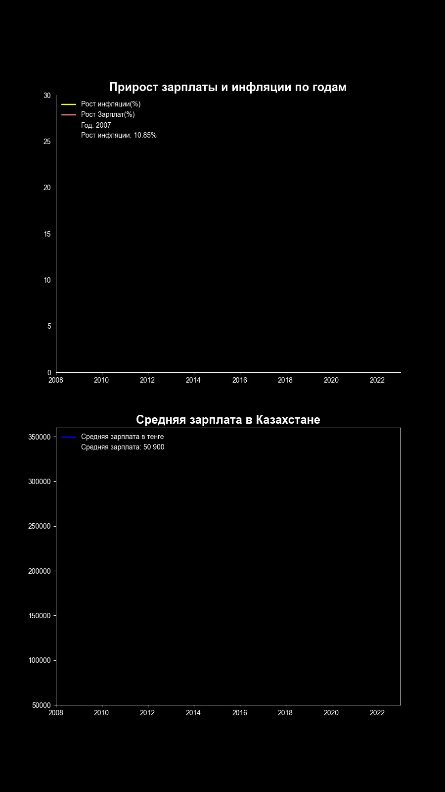

# Inflation and average salary rate from 2007 to 2050

Rate shows comparison to 2007's data

## Installation

Clone the repository

```shell
$ git clone https://github.com/open-data-kazakhstan/inflation-and-avg-salary-with-projections.git
```
Requires Python 3.11.3 

Create a virtual environment and activate it 

```bash
pip install venv
python -m venv /path/to/localrepo
```
Swicth to venv directory by using cd comand
```bash
cd /path/to/localrepo
Scripts/activate
```

Install dependecies in venv by using pip
```bash
pip install -r requirements.txt
```
Run the project:
```bash
python scripts/main.py
```

## Data 

Sourse data handly collected from stat.gov stats: https://stat.gov.kz/

We downoladed data from that source and located it in acrhive as source.xsls

We have processed the source data to make it normalized and derived  several aggregated datasets from it:

* `archive/csv_wranged.csv` - sourse data 
* `data/prediction.csv` - wranged and preprocessed data
* `data/csv_expanded.csv` - expanded main dataset which predicts populations from 2023 to 2050
* `datapackge.json` - conatins all of the key information about our dataset

## Scripts

* `wrang.py`- cleaning and wranging the source data script
* `expand.py` - uses main dataset and expands it to 8 steps to make animation soft
* `animate.py` - uses matplotlib to create an infographic about populations over the inflation and exports it to a gif file
* `datapack.py` - creating datapckage.json file that conatinsall meatadata
* `main.py` - launches all scripts step by step

## Visualization

Final result is visualized data that displays average salary and inflation data



